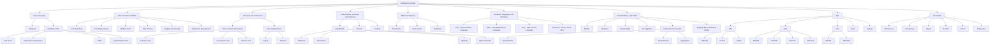

# DBMS
all you need to know to handle data
__________________________________________________________

```mermaid
graph TD;
    A[Database Concepts] --> B[Basic Concepts]
    A --> C[Characteristics of DBMS]
    A --> D[Concepts and Architecture]
    A --> E[Data Models, Schemas and Instances]
    A --> F[DBMS Architecture]
    A --> G[Database Languages and Interfaces]
    A --> H[Data Modelling - ER Model]
    A --> I[SQL]
    A --> J[Constraints]

    B --> B1[Database]
    B --> B2[Database Users]
    B2 --> B3[End Users]
    B2 --> B4[Application Programmers]
    B2 --> B5[DBAs]
    B2 --> B6[Sophisticated Users]

    C --> C1[Self-describing]
    C --> C2[Data Independence]
    C --> C3[Multiple Views]
    C --> C4[Data Sharing]
    C --> C5[Integrity and Security]
    C --> C6[Transaction Management]

    D --> D1[Three-Schema Architecture]
    D1 --> D2[External Level]
    D1 --> D3[Conceptual Level]
    D1 --> D4[Internal Level]
    D --> D5[Data Independence]
    D5 --> D6[Logical]
    D5 --> D7[Physical]

    E --> E1[Data Models]
    E1 --> E2[Relational]
    E1 --> E3[Hierarchical]
    E1 --> E4[Network]
    E1 --> E5[Object-Oriented]
    E --> E6[Schema]
    E --> E7[Instance]

    F --> F1[Centralized]
    F --> F2[Client-Server]
    F --> F3[Distributed]

    G --> G1[DDL - Data Definition Language]
    G --> G2[DML - Data Manipulation Language]
    G --> G3[DCL - Data Control Language]
    G --> G4[Interfaces - Forms, GUIs, APIs]

    H --> H1[Entities]
    H --> H2[Attributes]
    H --> H3[Relationships]
    H --> H4[ER Diagrams]
    H --> H5[Enhanced ER Concepts]
    H5 --> H6[Specialization]
    H5 --> H7[Generalization]
    H5 --> H8[Aggregation]
    H --> H9[Mapping ER to Relational Model]

    I --> I1[DDL]
    I1 --> I2[CREATE]
    I1 --> I3[ALTER]
    I1 --> I4[DROP]
    I --> I5[DML]
    I5 --> I6[INSERT]
    I5 --> I7[UPDATE]
    I5 --> I8[DELETE]
    I5 --> I9[SELECT]
    I --> I10[DCL]
    I10 --> I11[GRANT]
    I10 --> I12[REVOKE]
    I --> I13[Views]
    I --> I14[Indexes]

    J --> J1[Primary Key]
    J --> J2[Foreign Key]
    J --> J3[Unique]
    J --> J4[Not Null]
    J --> J5[Check]
    J --> J6[IN Operator]

```
